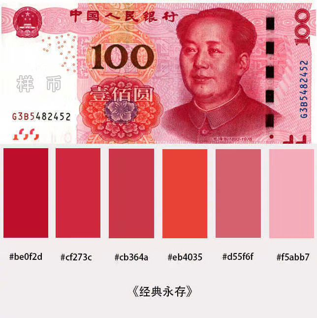
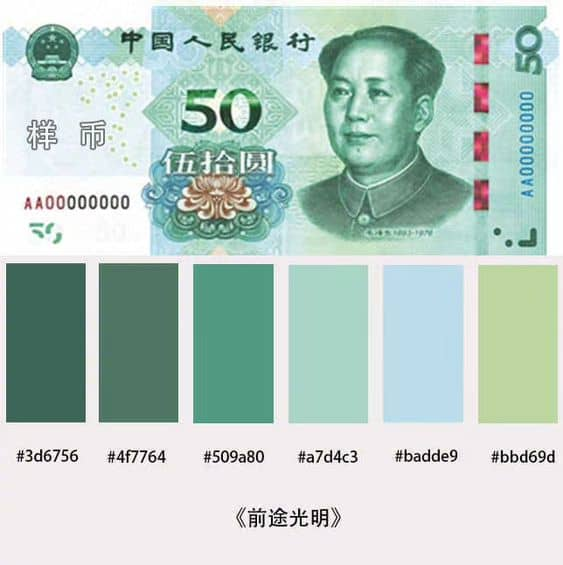
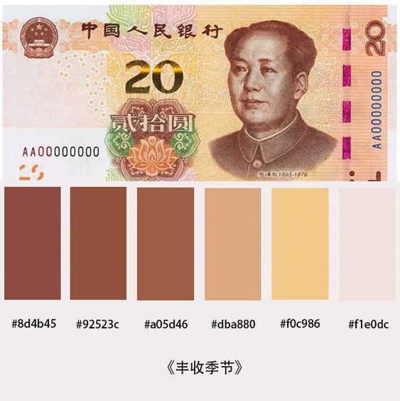
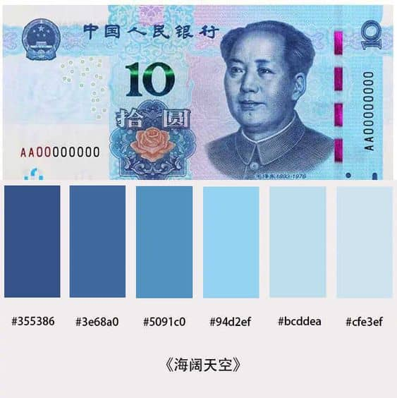
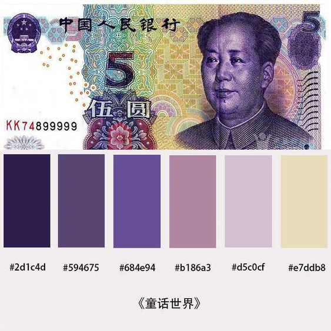
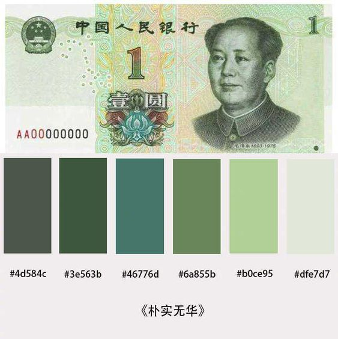
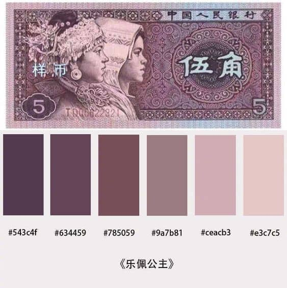
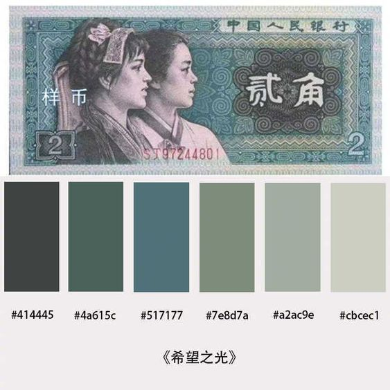
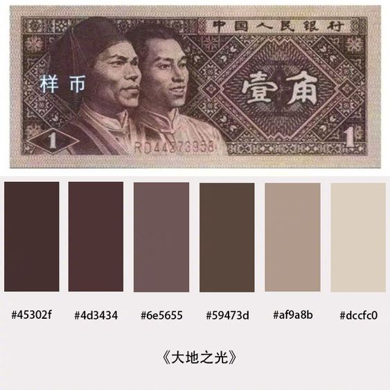

## 前言

CSP 的开发者并不是设计出身。一般，大部分程序[猿/媛]都是审美小白，对于审美小白来说，在选取色系的时候总是选得很丑的颜色。因此，我在这里给了一些 “国家级” 配色方案，那就是人民币配色，在绘制芯片时钟图很有用处，毕竟谁不喜欢人民币呢~

为了保持风格统一，请不要设计一些奇奇怪怪的配色方案，谢谢~

## 人民币纸币配色

### 壹佰圆

其中的颜色有：`#be0f2d`, `#cf273c`, `#cb364a`, `#eb4035`, `#d55f6f`, `#f5abb7`

### 伍拾圆

其中的颜色有：`#3d6756`, `#4f7764`, `#509a80`, `#a7d4c3`, `#badde9`, `#bbd69d`

### 贰拾圆

其中的颜色有：`#8d4b45`, `#92523c`, `#a05d46`, `#dba880`, `#f0c986`, `#f1e0dc`

### 拾圆

其中的颜色有：`#355386`, `#3e68a0`, `#5091c0`, `#94d2ef`, `#bcddea`, `#cfe3ef`

### 伍圆

其中的颜色有：`#2d1c4d`, `#594675`, `#684e94`, `#b186a3`, `#d5c0cf`, `#e7ddb8`

### 壹圆

其中的颜色有：`#4d584c`, `#3e563b`, `#46776d`, `#6a855b`, `#b0ce95`, `#dfe7d7`

### 伍角

其中的颜色有：`#543c4f`, `#634459`, `#785059`, `#9a7b81`, `#ceacb3`, `#e3c7c5`

### 贰角

其中的颜色有：`#414445`, `#4a615c`, `#517177`, `#7e8d7a`, `#a2ac9e`, `#cbcec1`

### 壹角

其中的颜色有：`#45302f`, `#4d3434`, `#6e5655`, `#59473d`, `#af9a8b`, `#dccfc0`
